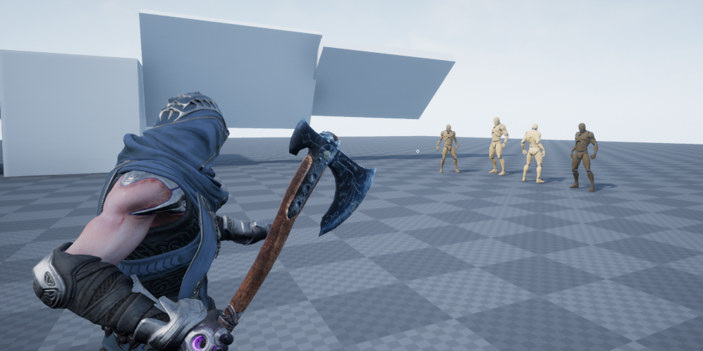
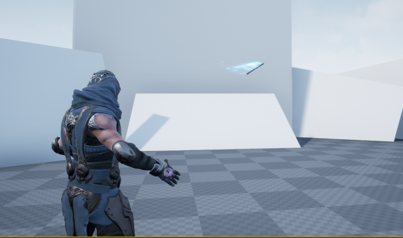
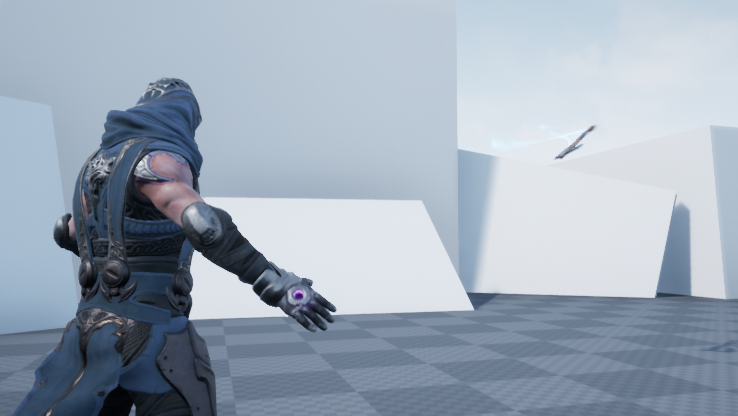
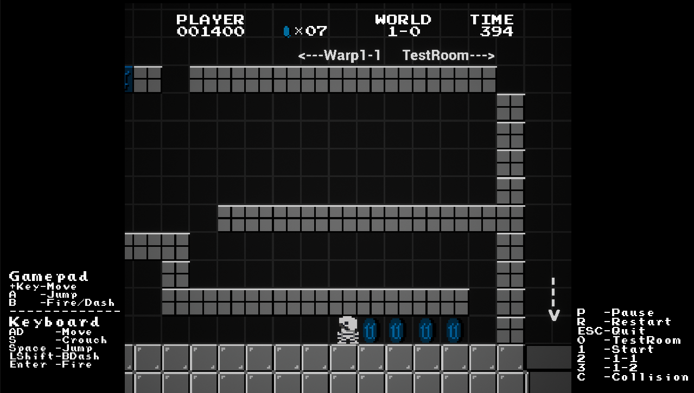
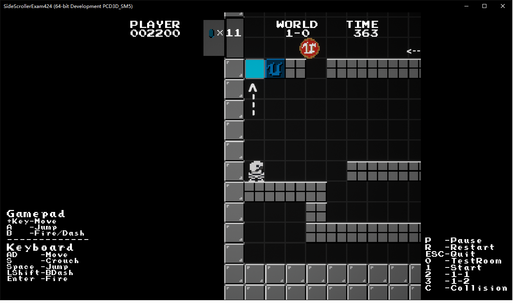
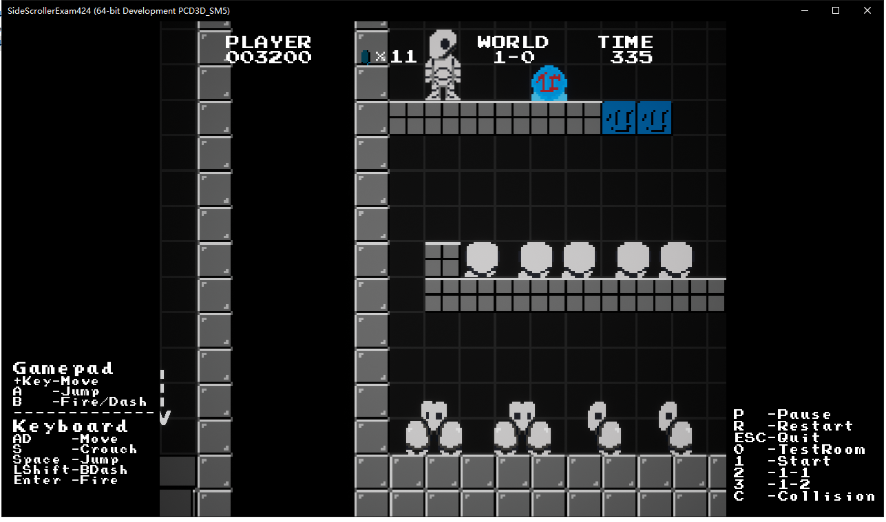
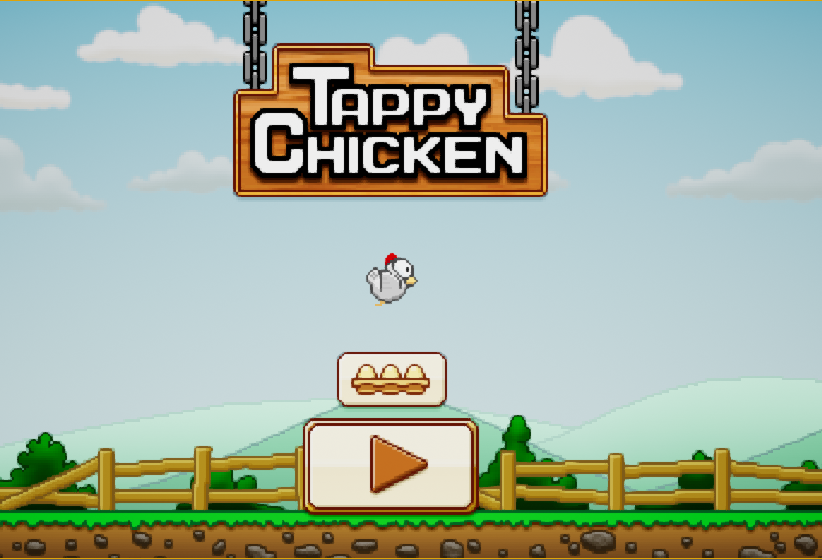
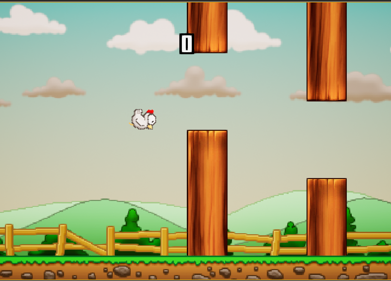
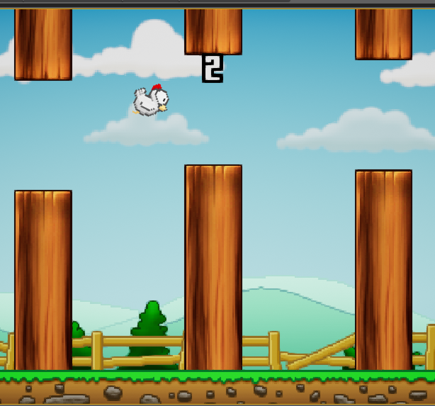

# UE4GameList
收集一些有意思且质量较高的UE4开源游戏项目

## 仿《战神4》 战斧武器相关
作者: Lewis Fiford

主页: https://www.youtube.com/user/popcornplaya206

该项目仿造了《战神4》中武器瞄准，战斧投掷，战斧曲线收回，回手表现，以及击中敌人和破坏物等，纯蓝图项目，很多细节的部分做的很到位，项目很值得一看。

项目截图如下:

## 仿《超级玛丽》 
原作者不详，链接是从B站一个Up主拿到的。

B站链接: https://www.bilibili.com/video/BV1vE411M7zx

属于2D项目，超级玛丽一些经典玩法还原度很高，值得学习！

项目截图如下:

## 《TappyChicken》 
虚幻官方的2d游戏。

项目截图如下:

